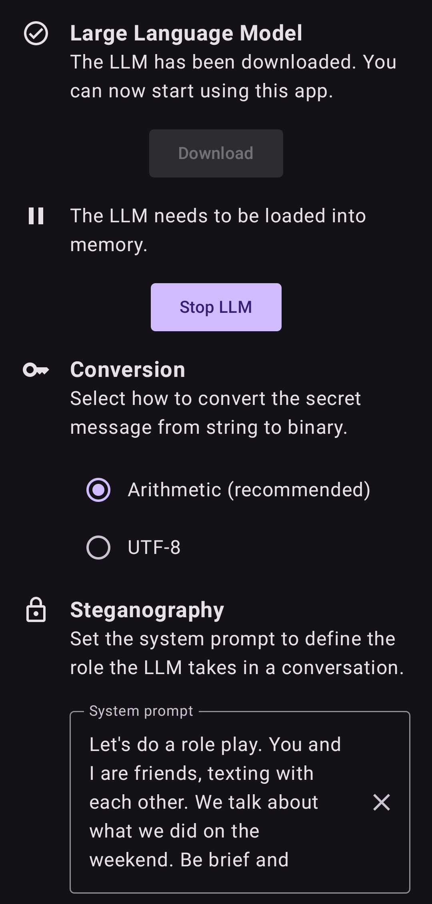

# HiPS
Hiding in Plain Sight (HiPS) is an Android app that performs steganography in chat messages. It runs a LLM locally to encode a secret message into a cover text you can send over instant messengers like WhatsApp or Signal. You can use it to protect your privacy from unwanted eavesdroppers like abusive partners or law enforcement officers.

## Contents
- [HiPS](#hips)
- [Screenshots](#screenshots)
- [Permissions](#permissions)
- [Dependencies](#dependencies)
- [Acknowledgements](#acknowledgements)

## Screenshots
HiPS consists of three screens. Let's walk through them.

### Home screen
On the home screen, you get steganography as a standalone functionality to use with existing instant messengers. You can encode a secret message into a cover text and decode it vice versa. Both encoding and decoding need a context. If the conversation switch is toggled on, the cover text will be a response to the context. Otherwise, it will be a continuation. Just copy-paste your messages here to use it.

    
    

### Conversation screen
On the conversation screen, you can see a more sophisticated demonstration of what steganography could look like if it was integrated into existing instant messengers. It shows a typical chat conversation, but the messages you type in are only stored locally and not sent anywhere. Effectively, you chat with yourself by constantly switching roles. You can switch roles manually by tapping the send button. By long-pressing it, you can toggle steganography on or off. If you long-press a message, you can decode or delete it.

    
    

### Settings screen
On the settings screen, you can manage the LLM and configure the steganography algorithms. All parameters are exposed and arranged in the order they are used in during encoding;
- Conversion of the secret message from string to binary
- System prompt for the LLM
- Number of messages to use as context on the conversation screen
- Steganography algorithms and their specific settings
  - Arithmetic: `temperature`, `topK` and `precision`
  - Huffman: `bitsPerToken`

The reset button at the bottom can be used to find sensible defaults for settings specific to the LLM (only when it is in memory). You need to do this when first using the app.

    
    

## Permissions
- Internet: Download the LLM from [HuggingFace](https://huggingface.co/).

## Dependencies
- [llama.cpp](https://github.com/ggml-org/llama.cpp): Run LLMs locally.
- Jetpack Compose: UI framework.
- DataStore Preferences: Store settings.
- Room: Local SQLite database.
  - KSP: Annotation processing.
- Kotlinx Serialization: Serialize Huffman codes to store in the database.

## Acknowledgements
- The steganography is based on the Stegasuras project ([Paper](https://arxiv.org/abs/1909.01496), [Demo](https://steganography.live/), [Code](https://github.com/harvardnlp/NeuralSteganography)).
- This app was developed as part of [my bachelor's thesis](https://github.com/tobiasvonderheidt/bsc-thesis) under supervision of the [SEEMOO](https://seemoo.de/) group at [TU Darmstadt](https://www.tu-darmstadt.de/).
